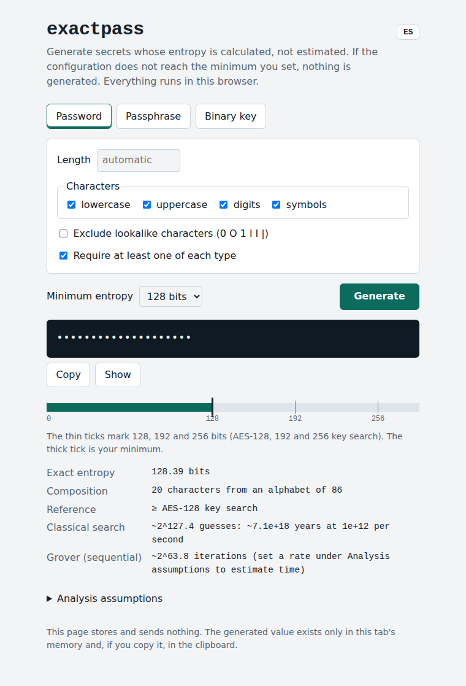

# exactpass

[English](README.md)

[](https://github.com/25Dark25/exactpass/actions/workflows/test.yml)

Generador local de contraseñas, passphrases y claves binarias. Calcula la entropía exacta de lo que genera y se niega a generar nada por debajo del mínimo que fijes (128 bits por defecto). Sin dependencias, sin acceso a la red, sin telemetría. Una página web y una herramienta de línea de comandos comparten el mismo núcleo, pequeño.



## Características

- **Entropía exacta, no estimada.** Se cuenta el número real de secretos posibles, también cuando exiges al menos un carácter de cada tipo.
- **Mínimo obligatorio.** Si la configuración no llega al umbral, no genera nada y te dice qué cambiar. Sin `--length`, elige la longitud mínima que lo cumple.
- **Muestreo uniforme.** Solo `crypto.getRandomValues`, con muestreo por rechazo para evitar el sesgo de módulo.
- **Tres tipos de secreto:** contraseñas, passphrases (a partir de una lista de palabras) y claves binarias (hex, base64, base64url).
- **Análisis con supuestos explícitos:** búsqueda clásica y algoritmo de Grover. Las estimaciones de tiempo usan solo las tasas que indiques.
- **Local.** La web tiene una política de seguridad de contenido (CSP) estricta, no guarda nada y no hace peticiones a terceros.
- **Inglés y español** en la web, el CLI y todos los mensajes.

## Inicio rápido

Requiere [Node.js](https://nodejs.org) 22 o superior. No hay nada que instalar.

```bash
git clone https://github.com/25Dark25/exactpass.git
cd exactpass
npm test
npm start
```

Después abre <http://127.0.0.1:8080>. Usa `npm start -- 8181` para otro puerto.

No abras `index.html` directamente desde el disco: los navegadores bloquean los módulos ES en URLs `file://`. Por eso el proyecto incluye un servidor mínimo que solo escucha en `127.0.0.1`.

## Descargar y verificar una release

Las releases están en la [página de Releases](https://github.com/25Dark25/exactpass/releases). Cada una incluye el zip, una firma OpenPGP separada (`.asc`) y el SHA-256 del zip en las notas de la release.

**Huella de la clave PGP:** `A7FC EDEA D7E6 C343 7312  284A 442D A687 E0FF 73EE`

- Publicada en keys.openpgp.org: <https://keys.openpgp.org/vks/v1/by-fingerprint/A7FCEDEAD7E6C3437312284A442DA687E0FF73EE>
- También en GitHub: <https://github.com/25Dark25.gpg>

```bash
# Linux / macOS
curl -sSL https://github.com/25Dark25.gpg | gpg --import
# Windows (PowerShell)
Invoke-WebRequest https://github.com/25Dark25.gpg -OutFile 25Dark25.gpg; gpg --import 25Dark25.gpg

gpg --fingerprint A7FCEDEAD7E6C3437312284A442DA687E0FF73EE   # debe coincidir con la huella de arriba
gpg --verify exactpass-0.1.2.zip.asc exactpass-0.1.2.zip       # usa los nombres de la release que descargaste
```

`gpg` informará de una firma correcta y también avisará de que la clave no está certificada; es lo esperado. Lo que importa es que la huella sea la misma en varios sitios independientes (este README, las notas de la release y keys.openpgp.org). Una firma válida demuestra que el archivo lo publicó quien controla esa clave, no quién es esa persona.

Para comprobar el hash: `sha256sum exactpass-0.1.2.zip` (Linux/macOS) o `Get-FileHash exactpass-0.1.2.zip -Algorithm SHA256` (PowerShell).

## Uso

### Web

Elige el tipo de secreto, fija la entropía mínima y pulsa Generar. La regla muestra la entropía exacta frente a las marcas de 128, 192 y 256 bits y tu mínimo. El botón **EN** (o `?lang=es` en la URL) cambia el idioma de la página.

### Línea de comandos

```bash
node bin/exactpass.js password                       # >= 128 bits, la longitud mínima que lo cumple
node bin/exactpass.js password --min-bits 256 --no-symbols
node bin/exactpass.js passphrase --wordlist wordlists/eff_large_wordlist.txt --separator " "
node bin/exactpass.js key --bytes 32 --format base64url
node bin/exactpass.js password --json
node bin/exactpass.js password --lang es             # o define EXACTPASS_LANG=es
```

En PowerShell, para dejar el español por defecto en la sesión: `$env:EXACTPASS_LANG = "es"`.

El secreto sale por stdout y el informe por stderr, así que puedes encadenar el secreto sin arrastrar el análisis. El código de salida es 0 si todo va bien y 2 si la configuración no es válida o no alcanza el mínimo.

| Opción | Modo | Descripción |
|---|---|---|
| `--min-bits N` | todos | Entropía mínima obligatoria (defecto 128) |
| `--length N` | password | Longitud (defecto: la mínima que cumple el umbral) |
| `--no-symbols` | password | Solo letras y dígitos |
| `--exclude-lookalikes` | password | Excluir `0 O 1 l I \|` |
| `--no-require-each` | password | No exigir un carácter de cada tipo |
| `--wordlist FICHERO` | passphrase | Lista de palabras (obligatoria) |
| `--words N` | passphrase | Número de palabras (defecto: las mínimas que cumplen el umbral) |
| `--separator S` | passphrase | Separador (defecto `-`) |
| `--capitalize` | passphrase | Primera letra de cada palabra en mayúscula (no añade entropía) |
| `--bytes N` | key | De 1 a 1024 (defecto 32) |
| `--format F` | key | `hex`, `base64` o `base64url` |
| `--rate N`, `--qrate N` | todos | Tasas para las estimaciones de tiempo |
| `--json` | todos | Salida JSON |
| `--lang en\|es` | todos | Idioma |

## Cómo se calcula la entropía

**Contraseña.** Para grupos de caracteres disjuntos de tamaños g₁…g_k, con C = Σgᵢ y longitud L, el número de cadenas que contienen al menos un carácter de cada grupo sale de la inclusión–exclusión:

```
N = Σ sobre subconjuntos S de los grupos de (−1)^|S| · (C − Σ_{i∈S} gᵢ)^L        entropía = log2(N)
```

Para generarla se elige cada carácter de forma uniforme sobre todo el alfabeto y se descarta la cadena entera si falta algún grupo. El resultado es uniforme sobre esas N cadenas. La alternativa tentadora, forzar un carácter por grupo y rellenar el resto, hace que unas cadenas sean más probables que otras, y `L · log2(C)` sobreestimaría la entropía.

**Passphrase.** Con una lista de W palabras únicas y n palabras, entropía = n · log2(W). Es la entropía de la *cadena* solo si secuencias de palabras distintas dan siempre cadenas distintas; la herramienta lo comprueba (Sardinas–Patterson) y avisa cuando no puede garantizarlo; en ese caso la cifra es una cota superior.

**Clave.** 8 × bytes.

| Configuración | Entropía |
|---|---|
| Contraseña por defecto (20 caracteres, alfabeto de 86) | 128,39 bits |
| Passphrase de 10 palabras de la lista de EFF (7776 palabras) | 129,25 bits |
| Clave de 32 bytes | 256 bits |

**Estimaciones.** La búsqueda clásica necesita de media unos 2^(bits−1) intentos. El algoritmo de Grover necesita unas (π/4)·2^(bits/2) iteraciones secuenciales. Solo se muestra una duración si indicas `--rate` / `--qrate`; son hipótesis tuyas y dependen del KDF y del hardware.

## ¿Es "post-cuántico"?

Un secreto simétrico solo se ve afectado por el algoritmo de Grover, que reduce una búsqueda de 2ⁿ a unas 2^(n/2) iteraciones y se paraleliza mal. 128 bits equivalen al nivel de referencia más bajo de NIST (búsqueda de clave de AES-128) y 256 bits dejan un margen amplio sin coste práctico. Lo que rompe un ordenador cuántico es la criptografía de *clave pública* (RSA, curvas elípticas) con el algoritmo de Shor, y eso queda fuera de esta herramienta. Para algo que escribes a mano y protege un KDF lento, entre 80 y 112 bits pueden ser razonables; es una decisión explícita (`--min-bits`), nunca el valor por defecto.

## Límites

- La cifra de entropía describe el **proceso de generación**. No dice nada de un secreto que hayas elegido tú.
- Las estimaciones de tiempo dependen de tasas que tú aportas. Son hipótesis, no mediciones.
- Los secretos viven en cadenas JavaScript inmutables: no se pueden borrar de la memoria de forma fiable y el sistema operativo puede escribirlas en el archivo de paginación.
- La web sobrescribe el portapapeles 30 segundos después de copiar, aunque hayas copiado otra cosa entretanto.
- No es un gestor de contraseñas. No guarda nada.
- No ha habido auditoría de seguridad independiente.

## Verificación

- `npm test` cubre la frontera del muestreo por rechazo, la uniformidad estadística (con un control negativo que debe rechazar un muestreador sesgado), el conteo exacto contrastado con fuerza bruta y con un segundo método, la coincidencia entre la entropía indicada y la entropía de Shannon empírica del generador, un fuzz determinista, el CLI, la lista de palabras y la correspondencia entre los mensajes en inglés y en español.
- La integración continua (`.github/workflows/test.yml`) ejecuta las pruebas en Linux, Windows y macOS con Node 22 y 24, y comprueba que el proyecto no tiene dependencias.
- Probado manualmente en Windows y Linux (CLI y web). La web se ejercitó en Chromium; Firefox y Safari no se han probado.
- Durante el desarrollo se introdujeron a mano cinco fallos (quitar el muestreo por rechazo, desactivar la comprobación del mínimo, invertir el signo de la inclusión–exclusión, desactivar la comprobación del separador, restaurar el muestreador sesgado) y las pruebas detectaron los cinco. No está automatizado.

## Estructura del proyecto

```
exactpass/
├── index.html            página web
├── serve.js              servidor local (solo 127.0.0.1, rutas en lista blanca)
├── bin/exactpass.js      línea de comandos
├── src/                  núcleo
│   ├── rng.js            aleatoriedad y muestreo sin sesgo
│   ├── entropy.js        conteo exacto y estimaciones
│   ├── generate.js       contraseña, passphrase y clave
│   └── i18n.js           mensajes en inglés y español
├── web/                  app.js, style.css
├── test/                 pruebas
└── wordlists/            lista larga de EFF
```

El núcleo de `src/` es la parte que hay que auditar. No tiene dependencias.

## Lista de palabras y licencias

El código es MIT. `wordlists/eff_large_wordlist.txt` es © Electronic Frontier Foundation bajo CC BY 3.0 US; ver [wordlists/README.md](wordlists/README.md). Usar otra lista es válido: la entropía solo depende del número de palabras únicas.

## Desarrollo

Este proyecto se desarrolló con la ayuda de Claude (Anthropic) y lo dirigió, probó y publicó su autor. Trátalo como cualquier código de seguridad sin auditar: lee `src/`, ejecuta las pruebas y júzgalo por lo que se puede verificar, no por quién lo escribió.

## Seguridad

Para reportar una vulnerabilidad, consulta [SECURITY.md](SECURITY.md).
